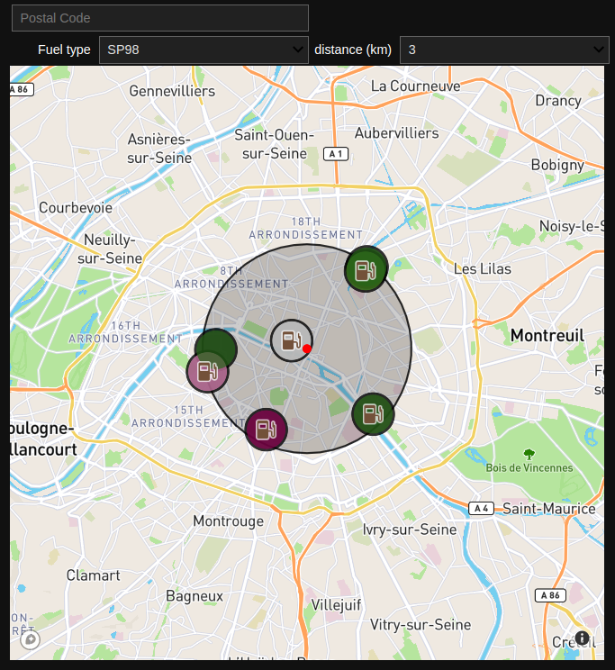

# Fuel-Station-Locator

A widget used as avisualisation tool about fuel prices in France. The widget allow filtering by fuel type, distance, and postal code. Once you hover over the fuel station, the prices can be seen.

